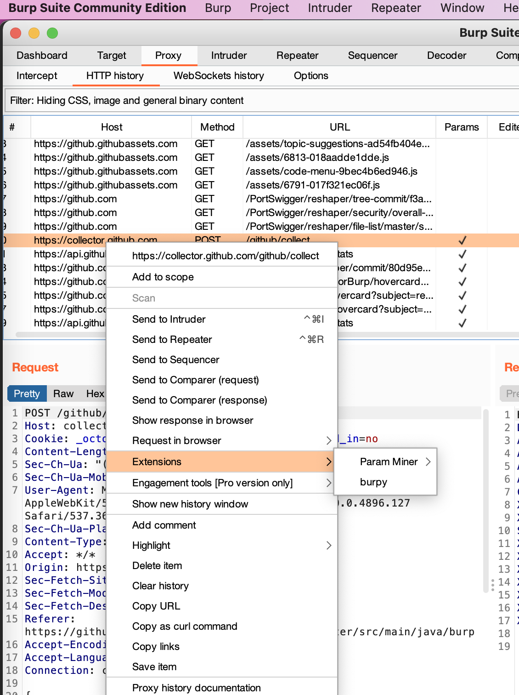
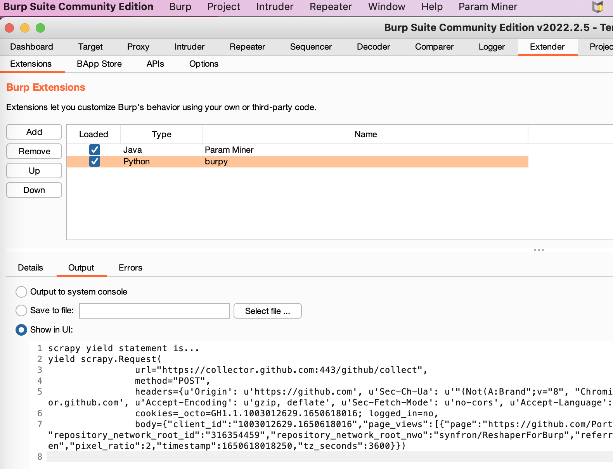
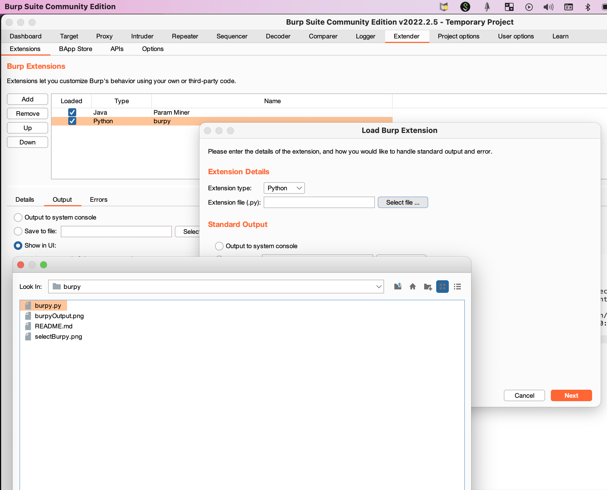

# BURPY

## OVERVIEW

A Burp Suite extension to convert Burp Suite requests into Scrapy yield statements

Requires Jython 2.7 

Example:

Highlight request and select Burpy in Extensions

Burpy outputs request as Scrapy yield statement

### INSTALLATION

Load Burpy as a python extension

